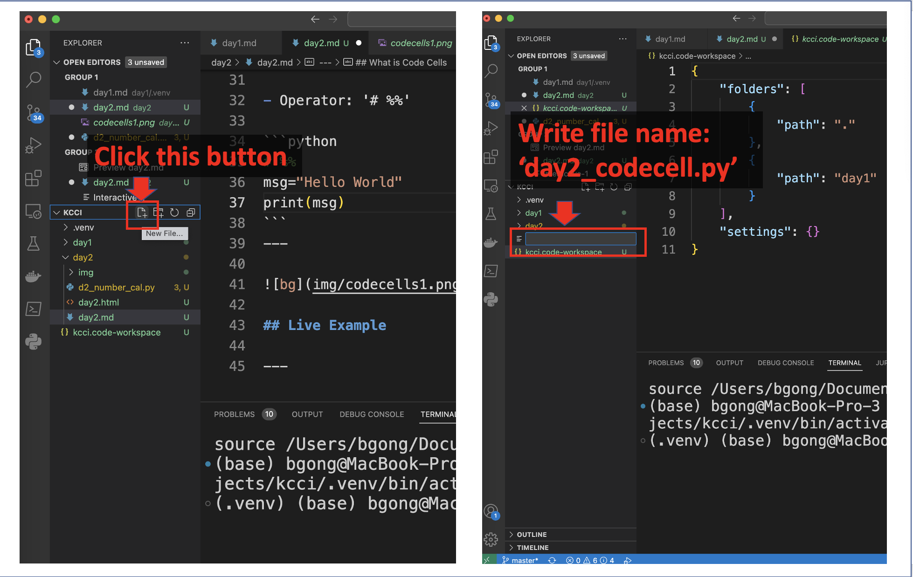
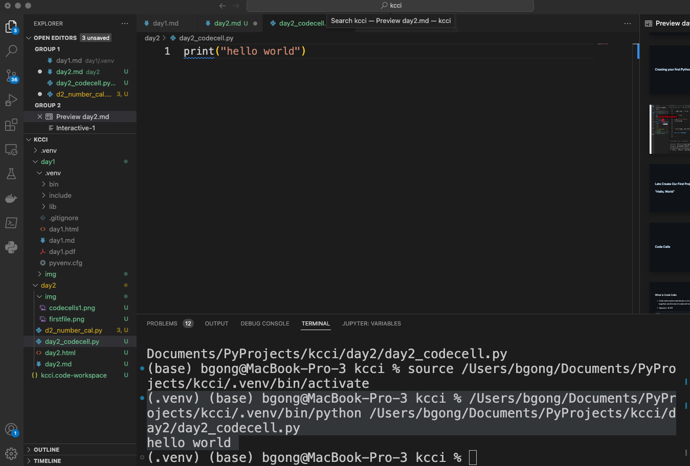
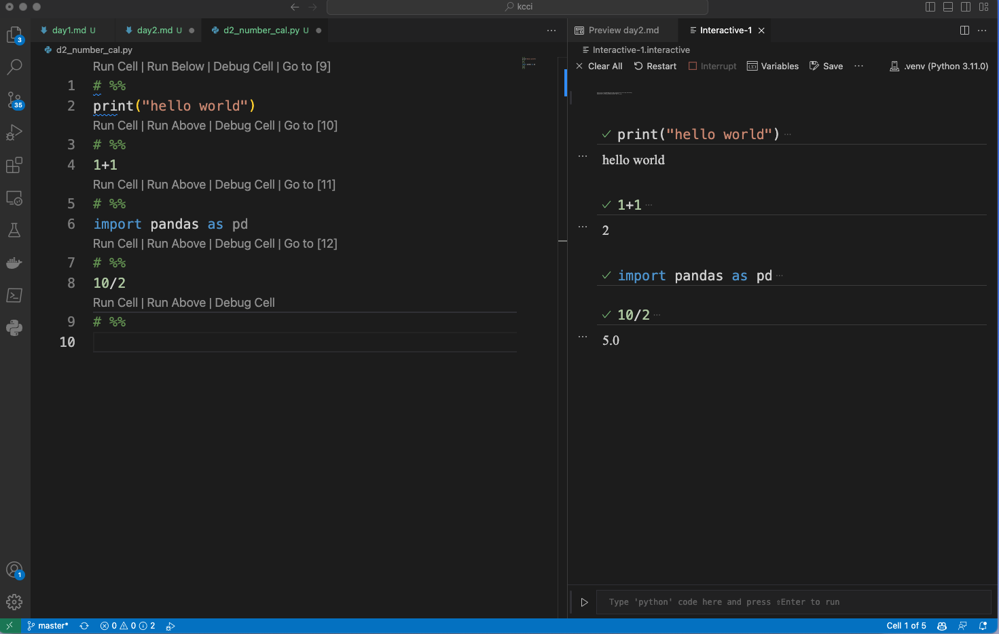
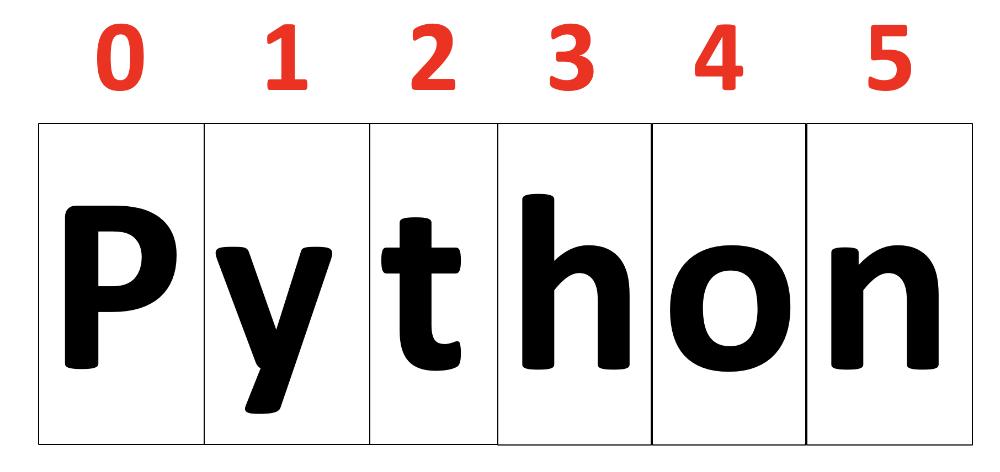
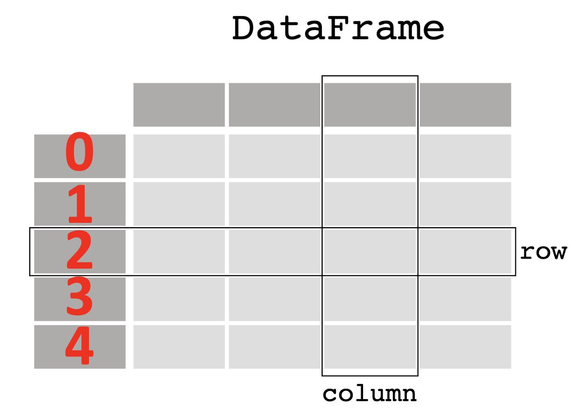

# **VScode and Python**
## Day2: Basic Syntax Structure of Python

Dr. Byoung-gyu Gong
Assistant professor 
Information System
Davide Eccles School of Business
University of Utah Asia Campus

---
# Contents
- First Project 
- Code Cells
- Basic Manipulations in Python
-- Number Calculation
-- String Manipulation
- Variables
-- Creating Variables
-- Manipulating Variables
- Indexing

---

# First Project


---

# Create Python Script File



---
# Lets Create Our First Project:
# "Hello, World"


---

# Code Cells

---
## What is Code Cells
- Code cells create code blocks or chunks that are bind together. They are executed all together, but the rest of codes will not be executed. 

- Operator: '# %%'

```python
# Run Cell|Run Below|Debug Cell
# %%
msg="Hello World"
print(msg)
```
---



## Live Example

---

# Basic Manipulations in Python

---

## **1. Number Calculations**

```python
# %%
2+2
```
4
```python
# %%
100*2
```
200
```python
# %%
100/4
```
25

---

```python
# %%
# Squared calculation
2 ** 2
```
4

```python
# %%
# Calculating remainder of division
15 % 2
```
1

---
## **2. String Manipulations**

2.1. Printing Format
```python
# String without quotation mark
fall
```
NameError: name 'fall' is not defined

```python
# String with quotation mark
'fall'
```
'fall'
```python
# String with quotation mark + print()
print('fall')
```
fall
- So you should put qutation mark('') for the string values.
- By using print() you can create more readable output.

---

2.2. Concatenation
- We can manipulate strings using arithmatic operators(+,-,*)
```python
print('K'+2*'C'+'I')
```
KCCI
```python
print('py''thon')
```
python

---
## Excercise-Question
Your monthly salary after the tax is $1000. This month your spending looks like this:
- Rent: $300
- Grocery: $300
- Others: $100

Please write down your formula in Python code.
1. How much is your total monthly spending? 
2. How much is the remaining after spending? 

---

## Excercise -Answer
Your monthly salary after the tax is $1000. This month your spending looks like this:
```python
# Salary:1000
# Rent:300
# Grocery:300
# Others:100
```
```python
#Question1.Total monthly spending
300+300+100
```
700
```python
#Question2.Remaining balance
1000-700
```
300

---

# Variables

---

## Basics
Variables indicates objects in the Python programming. They should be defined and declared to have specific value or function in them using operator '='. 

For instance, we can insert specific value into the string name variables:
```python
a=1
b=2
a,b
```
(1,2)
```python
# Even you can calculate variables having numeric values in it.
a+b
```
3

---
## Variable Manipulation: Syntax

# **'object.function(conditions)'**

```python
c="John"
b="10 years old"
print(c,":",b)
```
## 1. replace()
```python 
# replace(old,new)
b.replace('10','12')
```
'12 years old'

---

## 2. split()
```python
# split(delimiter)
c=b.split(' ')
```
['10', 'years', 'old']

## 3. 'delimiter'.join()
```python
d=' '.join(c)
d
```
'10 years old'

---
## 3. strip()
```python
# split(delimiter)
txt = "     banana     "
txt.strip()
```
'banana'

## 4. rstrip(),lstrip()
```python
txt = ' John '
print('[' + txt.rstrip() + ']')
print('[' + txt.lstrip() + ']')
print('[' + txt.strip() + ']')
```
[ John]
[John ]
[John]

---

# Exercise-Question

Please convert the following phone numbers into pure numbers - delete the hyphen('-') in the string.
```python
phone1='800-294-2934'
phone2='800-293-4920'
phone3='602-493-2999'
```

---

# Exercise-Answer

Please convert the following phone numbers into pure numbers - delete the hyphen('-') in the string.
```python
phone1='800-294-2934'
phone2='800-293-4920'
phone3='602-493-2999'
```
```python
a=phone1.replace('-','')
b=phone2.replace('-','')
c=phone3.replace('-','')
a,b,c
```
('8002942934', '8002934920', '6024932999')

---

# Indexing

---

## What is indexing
- Indexing is putting numbers indicating an order or location of the elements in the variables or data set.

## Starts with Zero(0)
- The indexing number in phyton always starts with zero.



---
# Indexing Basics
```python
# Indexing with single number
word='Python'
word[0]
```
'P
```python
# Indexing with a range
word[:2]
```
'Py'
```python
word[:6]
```
'Python'

---
```python
list = ['physics', 'chemistry', 1997, 2000]
list[0]
```
'physics'
```python
list[:2]
```
['physics','chemistry']
```python
list[:3]
```
['physics','chemistry',1997]

---
# Indexing + join()
```python
x='selflearning'
'-'.join([x[:4], x[4:12]])
```
'self-learning'

---

# Exercise - Question
Please convert the following phone numbers into the number with the hyphen('-') in the string.
```python
phone1='8002942934'
phone2='8002934920'
phone3='6024932999'
```
---
# Exercise - Answer
```python
phone1='8002942934'
phone2='8002934920'
phone3='6024932999'

'-'.join([phone1[:3], phone1[3:6], phone1[6:]])
'-'.join([phone2[:3], phone2[3:6], phone1[6:]])
'-'.join([phone3[:3], phone3[3:6], phone1[6:]])
```
'800-294-2934'
'800-293-4920'
'602-493-2999'