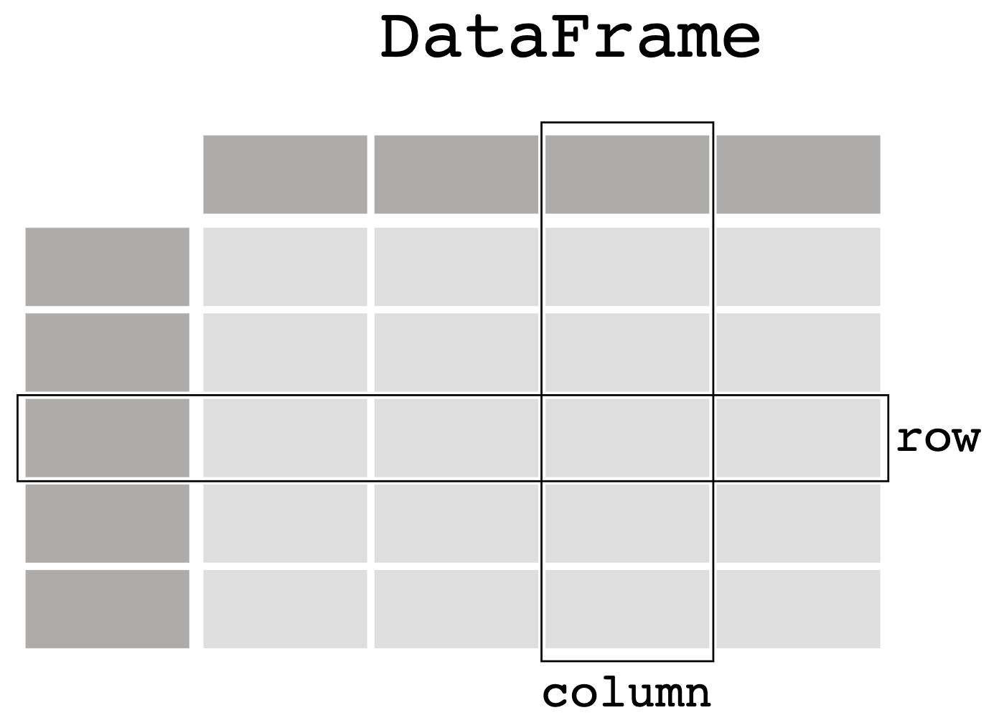
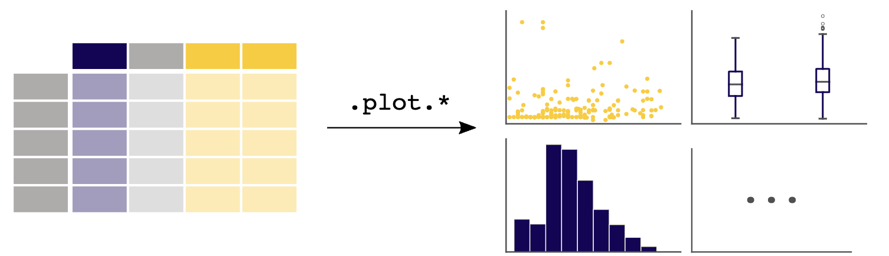
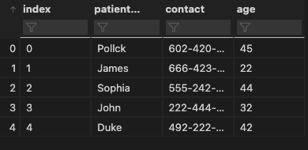
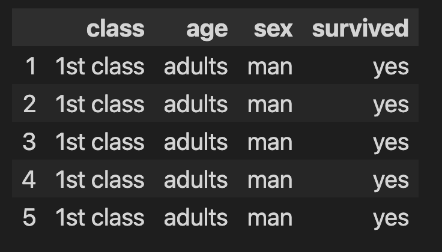
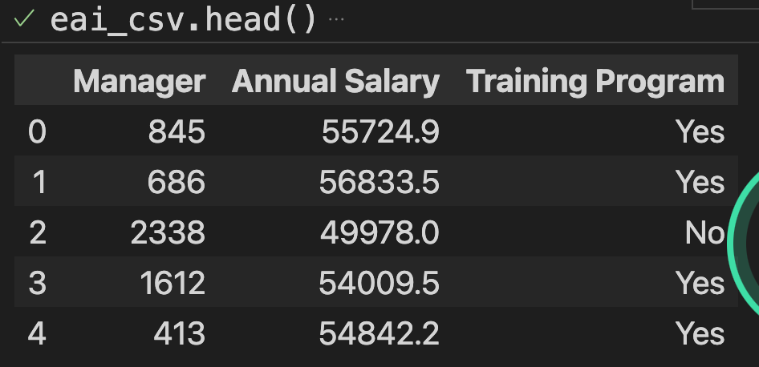
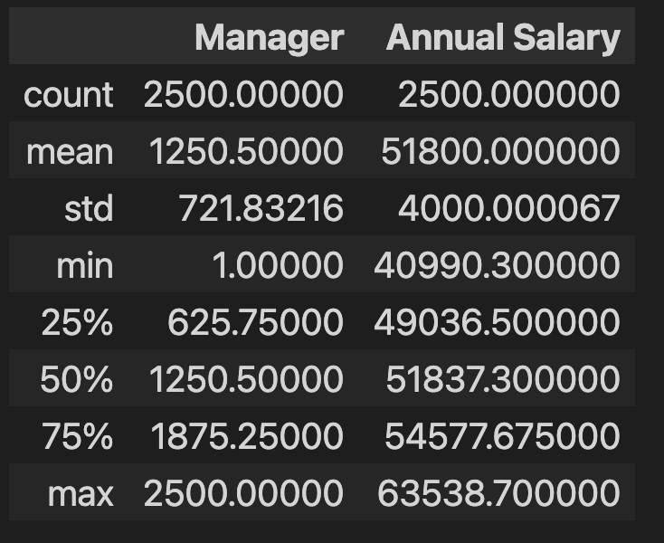
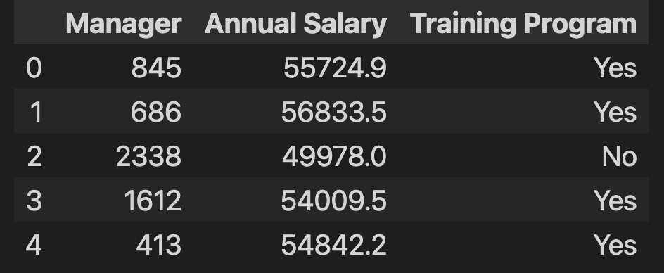

# **VScode and Python**
## Day3: Basic Syntax Structure of Python

Dr. Byoung-gyu Gong
Assistant professor 
Information System
Davide Eccles School of Business
University of Utah Asia Campus

---

# Contents
- Data Libraries
-- Numpy
-- Pandas
-- Load Libraries
- Data Types
-- List
-- Dictionary
-- Dataframe(Pandas)
- Data Loading in Pandas
-- Loading Package Data
-- Loading External Data
- Exploring Your Data

---

# Data Libraries

---
## Numpy
Powerful mathmatical computation tool running on the Python program. It supports a variety of high performance computation covering various mathemtics, physics, and statistics formula.
- It uses 'numpy.array' instead of list in python as it is more efficient and fast to process.
- We mostly use numpy's basic calculus functions such as sum, mean, and standard deviation.


---

## Pandas

Pandas is the Python library specialized in data processing and manipulation. In particular, it supports two-dimentional data type, called dataframe format. 


---

## Pandas(Cont.)
### Dataframe
Dataframe is the tabular data like you can see in excel or csv file. Big data is mostly stored in the database as a tabular data format so it is critical to know how to manipulate dataframe.



---
## Pandas(Cont.)
### Dataframe: Manipulation
1. Extract subset of the dataframe
2. Data visualization
3. Data summary
4. Data merge




---

## Install and Load Libraries
### 1. Installation
- In your terminal, insert the following command and push 'enter' button for execution.

``` {tmd}
pip install numpy
pip install pandas
```
### 2. Loading
```python
# Create new python script file called: firstPD.py
# Use code cells format
# %%
import numpy as np
import pandas as pd
# If you don't see any message, it means you successfuly installed and loaded your libraries.
```

---
# Data Types

- List
- Dictionary
- Dataframe(Pandas)

---
## List

```python
name=['John','Jane','Jason']
age=[13,14,15]
gender=[male,female,male]
name, age, gender
```
['John', 'Jane', 'Jason'] [13, 14, 15] ['male', 'female', 'male']

---
## Dictionary

```python
name=['John','Jane','Jason']
age=[13,14,15]
gender=[male,female,male]

# Let's convert multiple list into single dataframe

data={'name':name,
'age':age,
'gender':gender}
data
```
{'name': ['John', 'Jane', 'Jason'], 'age': [13, 14, 15], 'gender': ['male', 'female', 'male']}

---
## DataFrame

 # pd.DataFrame.from_dict()
```python
# Create dataframe with dictionary
df=pd.DataFrame.from_dict(data)
print(df)
```
  name  age  gender
0   John   13    male
1   Jane   14  female
2  Jason   15    male

---
# Exercise -Question
- Create your own dataframe given the information at below:
- We are running a hostpital business in a small town. We have an information for your patients. 
-- We have patients names of Pollck, James, Sophia, John, and Duke. 
-- Also, we have a contact information of each person like 602-420-4928, 666-423-4938, 555-242-4582, 222-444-5824, and 492-222-5827. 
-- We also have their age information like 45,22,44,32,and 42.

Please build up the Pandas dataframe as you learned. 

---
# Exercise -Answer

-- We have patients names of Pollck, James, Sophia, John, and Duke. 
-- Also, we have a contact information of each person like 602-420-4928, 666-423-4938, 555-242-4582, 222-444-5824, and 492-222-5827. 
-- We also have their age information like 45,22,44,32,and 42.
```python
#Create lists
patient_name=['Pollck', 'James', 'Sophia', 'John', 'Duke']
contact=['602-420-4928', '666-423-4938', '555-242-4582', '222-444-5824', '492-222-5827']
age=[45,22,44,32,42]
#Create dictionary
data={'patient_name':patient_name,'contact':contact,'age':age}
#Create dataframe
df_hosp=pd.DataFrame.from_dict(data)
print(df_hosp)
```

---
# Exercise -Answer


---

# Data Loading in Pandas
- Loading Interal Data
- Loading External Data

---

## Loading Interal Data

Internal data is the data predefined and stored in the Python libraries.

'pydataset' is the representative library providing a number of data sets.

```{cmd}
pip install pydataset
```
```python
# Load your library
import pydataset
# Look up the pydataset library and find a list of available datasets
pydataset.data()

df=pydataset.data('titanic')
```


---
## Loading External Data
- To load external excel file having .xlsx as extension, install openpyxl library first.
- Insert the following code 'pip install openpyxl' in your terminal console.

```{cmd}
pip install openpyxl
```

---
- First, drag and drop your 'csv' file into your current project folder.


---
- Second, import the data file using the following code:
```python
# pd.read_excel(): Import excel file
eai_excel=pd.read_excel('EAI.xlsx')

# pd.read_csv(): Import csv file
eai_csv=pd.read_csv('EAI.csv')

eai_excel.head()
eai_csv.head()
```


---
# Exploring Your Data

---
# describe()
```python
# Our loaded data file is 'eai_csv'
# Load 'eai_csv' and Describe its summary.
eai_csv.describe()
```


---

### head()
```python
# Our loaded data file is 'eai_csv'
# Load 'eai_csv' and show us only first 5 Head rows.
eai_csv.head()
```


---
# Exercise-Question
- Please load your EAI.csv and EAI.xlsx data. 
- Then, explore the data set using describe() and head() function.
- Let's discuss what this data set is about.