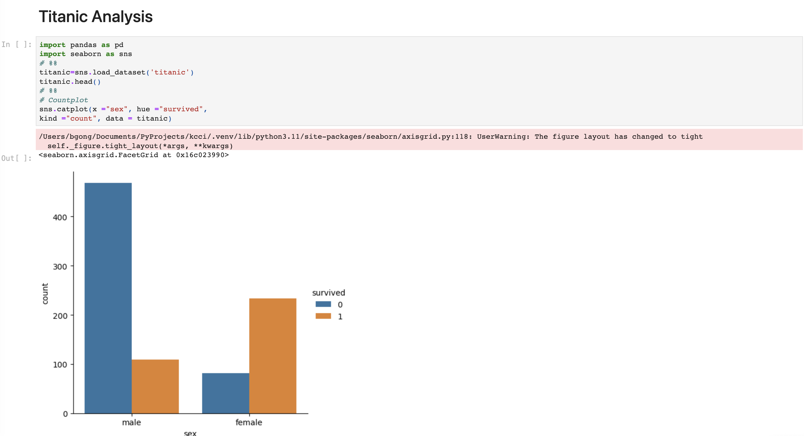
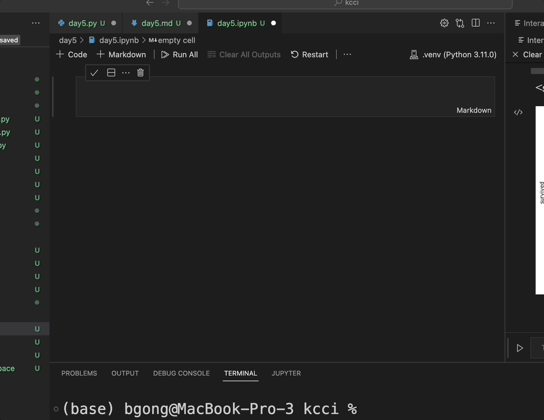
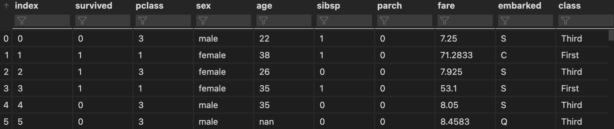
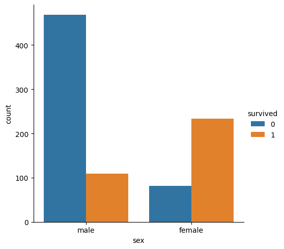

# **VScode and Python**
## Day5: Data Visualization

Dr. Byoung-gyu Gong
Assistant professor 
Information System
Davide Eccles School of Business
University of Utah Asia Campus

---
Setting up Jupyter Notebook
- How to create Jupyter Notebook
- Example of Jupyter Notebook
- Basics of Jupyter Notebook
- How to export html file

Seaborn Library
- What is Seaborn Library
- Installation and Import
- Preparing your Data
- Seaborn Syntax Structure
- Your First Chart

---
Titanic: Key Factor for Survival
- Sex and Survival
- Class and Survival
- Age and Survival
- Alone and Survival

---

# Setting up Jupyter Notebook

- How to Create Jupyter Notebook
- Example of Jupyter Notebook
- Basics of Jupyter Notebook
- How to Export HTML File

---
## How to create Jupyter Notebook

## **filename.ipynb**


---
## Example of Jupyter Notebook

[Seaborn Data Blog](https://seaborn.pydata.org/tutorial/relational.html)


---
## Basics of Jupyter Notebook

- Select your kernel.
- Markdown: You can freely write anything on the markdown section.
- Code: You can write down your python code in the code section.

- Jupyter Notebook present your output right below of your code. 
- The output section present tables and charts, too.
---
## How to Export HTML File



---
# Seaborn Library
- What is Seaborn Library
- Installation and Import
- Preparing your Data
- Your First Chart

---
## What is Seaborn Library
- Seaborn library is one of the data visualization library in the Python script language. 
- It provides easy and diverse functions to simply visualize pandas data sets.
[Seaborn](https://seaborn.pydata.org/)


---
## Installation and Import

1. Installation
```{cmd}
pip install seaborn
```

2. Import
```python
# Import pandas always to handle datatable
import pandas as pd
import seaborn as sns
```

---
## Preparing your Data
- We will use titanic data set. 
- Our purpose of the analytics is to see what factors influenced on the survival of the passengers.
```python
titanic=sns.load_dataset('titanic')
titanic.head()
```


---
## Seaborn Syntax Structure 

# sns.catplot(data='df', x='var1', y='var2', hue='var3', style='var4', orient='h'/'v', kind='strip'/'swarm'/'box'/'violin'/'boxen'/'point'/'bar'/'count')

---
## Your First Chart
1. Catplot
```python
sns.catplot(x ="sex", hue ="survived",
kind ="count", data = titanic)
```


---

# Titanic: Key Factor for Survival
- Sex and Survival
- Class and Survival
- Age and Survival
- Alone and Survival

---
## Sex and Survival
```python
sns.catplot(data=titanic, x='sex', hue='survived', kind='count')
```

---
## Sex and Survival
```python
sns.catplot(data=titanic, x='sex', hue='survived', kind='count')
```
```python
sns.catplot(data=titanic, x='sex', y='survived', kind='box')
```

---
## Class and Survival
```python
# Count
sns.catplot(data=titanic, x='pclass', hue='survived', kind='count')
```
```python
# Violin
sns.catplot(data=titanic, x='pclass', y='survived', kind='violin')
```
```python
# Point: Combining class and sex
sns.catplot(data=titanic, x='pclass', y='survived', hue='sex', kind='point')
```

---
## Age and Survival
```python
# displot with kde
sns.displot(titanic, x="age", hue="survived", kind="kde")
```
```python
# age and sex combined: Violin
sns.catplot(
    data=titanic, x="sex", y="age", hue="survived",
    kind="violin", split=True,
)
```

---
## Alone and Survival
```python
sns.catplot(data=titanic, x='alone', hue='survived', kind='count')
```
```python
# Class and alone combined
sns.catplot(
    data=titanic, x="pclass", y="survived", hue="alone",
    kind="point"
)
```

---
# Conclusion??

---
# Excercise -Question

Please explore seaborn dataset 'tips'. And explore the driving factor increasing total bill.

---
